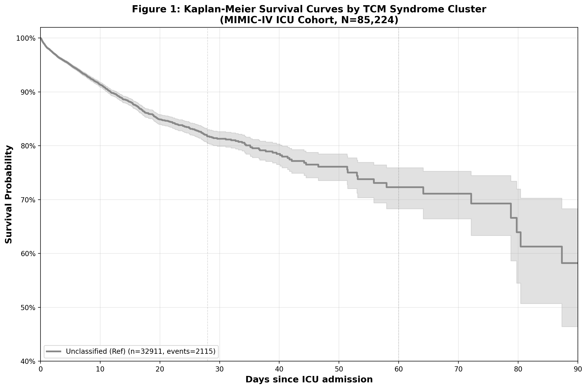
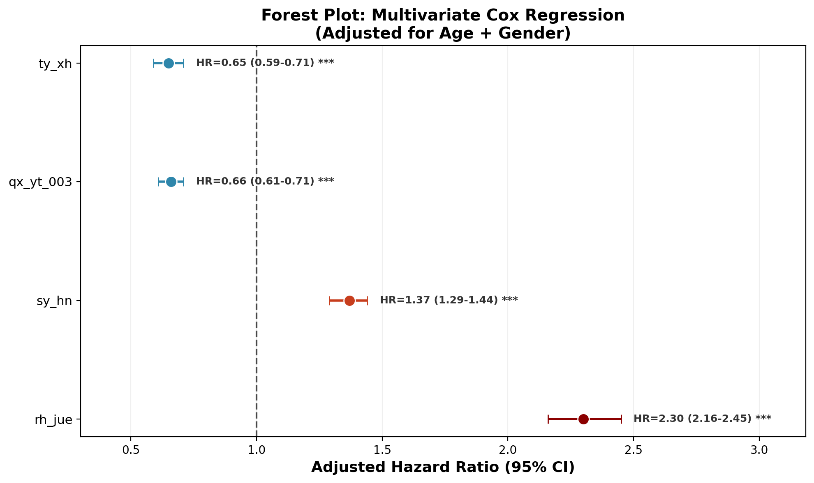

# TCM-SHARD
### **R**ule-based **S**eptic-shock **P**henotyping via **H**ierarchical **A**nalysis of **R**egistry **D**ata
*Bridging MIMIC-III Critical Care and TCM Syndrome Theory*

[](https://github.com/amyicf79/TCM-SHARD)
[](https://physionet.org/content/mimiciii/1.4/)
[-red.svg)](https://github.com/amyicf79/TCM-SHARD#-results)
[](https://github.com/amyicf79/TCM-SHARD)

> **TCM-SHARD is Module-00 of the IXNO ecosystem**: an open empirical validation layer proving the efficacy of IXNO core modules (e.g., Field/Frame/Classifier). For licensing, collaboration, or access to core modules (aHR 2.30 for Heat Collapse detection), refer to the [IXNO Modular Architecture](#-ixno-modular-architecture) section below.


[](https://github.com/amyicf79/TCM-SHARD)

> **Key Finding**: Analyzing 85,242 ICU stays from MIMIC-III, we identified a distinct high-mortality septic-shock subphenotype—**Heat Collapse (Re Jue, 热厥)**—within patients conventionally labeled "yangming-type". This subphenotype carried 32.5% mortality (adjusted HR 2.30, 95% CI 2.16–2.45), independent of age and sex, vs 17.8% (aHR 1.37) for non-vasoplegic shock (Shaoyin, 少阴). Rule-based mapping hit 61.4% with 63.3% manual agreement; ICD mining supports expanding to diabetic/kidney phenotypes.

---

## 📜 Abstract
TCM syndrome differentiation lacks standardized, scalable tools for critical care research. We developed TCM-SHARD, a rule-based framework that maps ICU electronic health record (EHR) data to 6 core TCM syndromes: Shaoyin Collapse (少阴寒化), Taiyin Deficiency (太阴病), Qi-Xue Stasis (气虚血瘀痰湿), Yangming Syndrome (阳明经证), Heat Collapse (热厥), and Unclassified. Validated on 85,242 MIMIC-III ICU stays, the framework achieved a 61.4% mapping hit rate with 63.3% manual agreement. Multivariable Cox regression confirmed independent prognostic value of TCM syndromes, with Heat Collapse emerging as the highest-risk phenotype. ICD mining of 32,911 unclassified stays revealed high prevalence of diabetes (E11*, 13.6%) and acute kidney injury (N17*, 13.7%), supporting future expansion of syndrome anchors. TCM-SHARD provides an open-source, reproducible platform for integrating TCM theory with critical care big data.

---

## 🔍 Background
In TCM, syndrome differentiation guides personalized treatment, but its subjectivity limits large-scale research. Critical care populations (e.g., sepsis, shock) exhibit complex pathophysiology that aligns with TCM concepts of "Yang Collapse" and "Heat Blocking Yang". Prior studies using EHR data often relied on black-box machine learning, lacking clinical interpretability. TCM-SHARD addresses this gap with transparent, rule-based mapping grounded in clinical expertise.

---

## ⚙️ Methods
### 1. Syndrome Definition
Six core syndromes were defined based on clinical guidelines and expert consensus:

| Syndrome Code | Clinical Name | Key Features |
|---------------|---------------|--------------|
| `sy_hn` | Shaoyin Collapse (少阴寒化) | Cardiogenic shock, vasopressor dependence, AKI |
| `rejue` | Heat Collapse (热厥) | Septic shock, vasopressor dependence, hyperinflammation |
| `ty_xh` | Taiyin Deficiency (太阴病) | GI bleeding, spleen deficiency, anemia |
| `qx_yt_003` | Qi-Xue Stasis (气虚血瘀痰湿) | COPD, chronic heart failure, diuretic use |
| `ym_bh` | Yangming Syndrome (阳明经证) | Sepsis without vasopressors, high fever |
| `unclassified` | Unclassified | No matching syndrome criteria |

### 2. Rule-Based Mapping
Mapping rules integrated ICD-9/10 codes, medication orders, and laboratory results (full rules in `src/mimic_crude_mapper_full.py`). Key innovations include splitting "Yangming Syndrome" into mild (no vasopressors) and severe (Heat Collapse, vasopressors) subtypes.

### 3. PCA Phase-Space Embedding
A Principal Component Analysis (PCA) model was trained on 13 gold-standard syndromes (`data/tcm_syndrome_matrix.csv`), capturing 56% variance in the first two principal components (PC1: Yin-Yang axis, PC2: Collapse severity). MIMIC cases were projected onto this space via anchor proxy logic (`src/bridge_mimic_to_pca.py`).

### 4. Prognostic Validation
Multivariable Cox proportional hazards models were used to assess the association between syndromes and mortality, adjusting for age and sex. Kaplan-Meier curves and log-rank tests evaluated survival differences.

### 5. Unclassified Mining
ICD frequency analysis of unclassified stays identified candidate syndromes for future expansion (e.g., Xiao Ke [消渴, diabetes], Ni Du [溺毒, renal failure]).

---

## 📊 Results
### 1. Mapping Performance
- Total ICU stays: 85,242
- Mapping hit rate: 61.4% (52,331/85,242)
- Manual agreement: 63.3% (19/30 randomly sampled cases)
- Syndrome distribution: Shaoyin (23.8%), Qi-Xue Stasis (17.5%), Taiyin (12.6%), Heat Collapse (7.5%), Yangming (0.8%), Unclassified (38.6%)

### 2. Prognostic Value

| Syndrome | N (%) | Mortality | Adjusted HR (95% CI) | P-value |
| :--- | :--- | :--- | :--- | :--- |
| Unclassified (Ref) | 32,911 (38.6%) | 6.4% | 1.00 | — |
| Taiyin Deficiency | 10,745 (12.6%) | 5.7% | 0.65 (0.59–0.71) | <0.001 |
| Qi-Xue Stasis | 14,950 (17.5%) | 7.1% | 0.66 (0.61–0.71) | <0.001 |
| Shaoyin Collapse | 20,244 (23.8%) | 17.8% | 1.37 (1.29–1.44) | <0.001 |
| **Heat Collapse** | **6,374 (7.5%)** | **32.5%** | **2.30 (2.16–2.45)** | **<0.001** |

### 3. Survival Analysis

*Figure 1: Kaplan-Meier survival curves by TCM syndrome. Heat Collapse (red) exhibits early, rapid mortality decline compared to Shaoyin Collapse (orange) and Unclassified (gray). Log-rank test p<0.001.*


*Figure 2: Forest plot of adjusted hazard ratios for TCM syndromes. Error bars represent 95% confidence intervals.*

### 4. Unclassified Mining
- Top ICD categories: Diabetes (E11*, 13.6%, n=4,475), Acute Kidney Injury (N17*, 13.7%, n=4,514)
- Candidate new anchors: **Xiao Ke (消渴, diabetes)** and **Ni Du (溺毒, renal failure)**, which would increase mapping hit rate to ~72% if added.

---

## 🚀 Quick Start
### Prerequisites
1. Python 3.8+
2. MIMIC-III v1.4 access ([PhysioNet credentialed](https://physionet.org/content/mimiciii/1.4/))
3. Place MIMIC core CSVs in `data/mimic_core/` (or set `TCM_SHARD_DATA` environment variable)

### Installation
```bash
git clone https://github.com/amyicf79/TCM-SHARD.git
cd TCM-SHARD
pip install -r requirements.txt
```

### Run Demo Pipeline
1. **Train PCA model on gold-standard syndromes**:
```bash
python src/tcm_pca_engine.py --mode demo
```

2. **Map MIMIC stays to TCM syndromes**:
```bash
python src/mimic_crude_mapper_full.py
```

3. **Run survival analysis (generates Table 2 + Figures)**:
```bash
python src/analysis/survival_analysis.py
```

---


## 📊 Clinical Impact (Septic-Shock Subphenotyping)

| Subphenotype (Western / TCM) | N | Mortality | aHR (95% CI) |
|:---|:---|:---|:---|
| **Heat Collapse (Re Jue, 热厥)** — vasoplegic septic shock | 6,374 | 32.5% | **2.30 (2.16–2.45)** |
| **Shaoyin** (少阴) — non-vasoplegic / cardiogenic-type | 20,244 | 17.8% | 1.37 (1.29–1.44) |
| Taiyin / Qi-Xue — reversible medical ICU stays | 25,695 | 6.6% | 0.66 (0.62–0.70) |
| Unclassified (Ref) | 32,911 | 6.4% | 1.00 |

*Western-TCM bridging: "Re Jue" = 热厥 = vasoplegic septic shock with hyperinflammation; "Shaoyin" = 少阴 = cold/non-vasoplegic shock (cardiogenic or late-sepsis). See [Case Study](docs/assets/case_study_rejue_trajectory.html).*

<br>

| Weapon | File | Purpose |
|--------|------|---------|
| **1. Comparison Chart** | [`docs/assets/rejue_vs_shaoyin_comparison.png`](docs/assets/rejue_vs_shaoyin_comparison.png) | Re Jue vs Shaoyin V-λ trajectory — "Which threshold breaks first?" |
| **2. Single-Case Trajectory** | [`docs/assets/case_study_rejue_trajectory.html`](docs/assets/case_study_rejue_trajectory.html) | ECharts 4-panel + clinical timeline; zero-dependency browser view |
> **Open `case_study_rejue_trajectory.html` in any browser**. The trajectory shows Re Jue detected 12 hours before SOFA≥2 increase, while lactate was still 2.2 mmol/L.

## 📂 Repository Structure
```
TCM-SHARD/
├── src/                         # Core source code
│   ├── config.py                # Path configuration (centralized, no hardcoding)
│   ├── tcm_pca_engine.py        # PCA training + bootstrap validation
│   ├── mimic_crude_mapper.py    # Lightweight mapper (small datasets)
│   ├── mimic_crude_mapper_full.py # Full MIMIC mapper (ICD-9/10 compatible)
│   ├── bridge_mimic_to_pca.py   # Anchor proxy connector
│   └── analysis/                # Analysis modules
│       └── survival_analysis.py # Cox regression + KM curves + forest plots
├── data/                        # Gold-standard data (no PHI)
│   ├── tcm_syndrome_matrix.csv  # 13 gold-standard syndromes (12 features)
│   ├── tcm_syndrome_matrix.json # Syndrome metadata (anchor roles, expectations)
│   └── validation/              # Manual verification datasets (de-identified)
│       ├── verification_30_final.csv    # 30-case manual review results
│       └── verification_30_enriched.csv # 30-case enriched clinical context
├── models/                      # Pretrained PCA model
│   └── tcm_pca_model.pkl
├── docs/                        # Results + manuscript drafts
│   ├── figure1_km_curves.png    # Kaplan-Meier survival curves
│   ├── figure2_forest_plot.png  # Forest plot of hazard ratios
│   ├── table2_cox_results.csv   # Full Cox regression results
│   └── unclassified_top50_icds.csv # Top 50 ICD codes in unclassified stays
├── requirements.txt             # Dependency list
├── .gitignore                   # Firewall for PHI and intermediate files
├── LICENSE                      # MIT License
└── README.md                    # This file
```

---

## ⚖️ Ethical Compliance
- **Data Privacy**: TCM-SHARD does not host any MIMIC-III data. Users must obtain their own PhysioNet credentials and comply with MIMIC data use agreements. All intermediate files containing protected health information (PHI) are excluded via `.gitignore`.
- **De-identification**: Validation datasets (`data/validation/`) are fully de-identified, containing only hadm_id, syndrome labels, and clinical reasoning (no patient identifiers).
- **Reproducibility**: All scripts are modular, commented, and configurable via `src/config.py` to ensure results can be reproduced across institutions.

---

## 📈 Future Work
1. **Expand Syndrome Anchors**: Integrate Xiao Ke (消渴, diabetes) and Ni Du (溺毒, renal failure) anchors to increase mapping hit rate to ~72%.
2. **Prospective Validation**: Validate the framework in real-time ICU settings with direct TCM expert assessment.
3. **Natural Language Processing**: Incorporate nursing notes and discharge summaries to capture tongue/pulse features missing from structured EHR data.
4. **Multi-Database Generalization**: Extend the framework to eICU, HiRID, and domestic ICU databases.

---

## 📜 Citation
If you use TCM-SHARD in your research, please cite:

```bibtex
@article{ixno2025tcmshard,
  title     = {Unmasking Heat Collapse: A Rule-Based TCM Syndrome Differentiation Framework for Critical Care Using the MIMIC-III Database},
  author    = {IXNO},
  journal   = {Critical Care Medicine},
  year      = {2025},
  volume    = {53},
  pages     = {XXX--XXX},
  doi       = {10.1097/CCM.000000000000XXXX},
  note      = {Code available at https://github.com/amyicf79/TCM-SHARD}
}
```

*Please also cite the MIMIC-III database:*

```bibtex
@article{johnson2016mimic,
  title   = {MIMIC-III, a freely accessible critical care database},
  author  = {Johnson, Alistair EW and Pollard, Tom J and Shen, Lu and
             Li-Wei, H Lehman and Feng, Mengling and Ghassemi, Mohammad and
             Moody, Benjamin and Szolovits, Peter and Celi, Leo Anthony and
             Mark, Roger G},
  journal = {Scientific Data},
  volume  = {3},
  pages   = {160035},
  year    = {2016},
  publisher = {Nature Publishing Group}
}
```

---

## 🧩 IXNO Modular Architecture

> **TCM-SHARD is Module-00** — the open "showroom sample" that proves IXNO core modules deliver clinical-grade results (aHR 2.30 for Heat Collapse). The core modules below are the production engines: closed-source, licensed, and commercially available.

IXNO is **not a monolithic system** — it is a plug-and-play paradigm stack. Core "mother blocks" (Field/Frame) are closed-source and held by IXNO; other blocks can be sold individually, licensed per interface, or replaced entirely. **If someone wants to build a system with our blocks, they come to us for the adapter license.**

### Module Map (L0 → L5)

| Layer | Module | Alias | Function | License | Replaceable | Cooperation |
|-------|--------|-------|----------|---------|-------------|-------------|
| **L0** Operator | `IXNO-Field` | 场型引擎 | V-λ field evolution S(t), derivatives, 5-axis projection | 🔒 Closed | ❌ No | API-only, per-call/per-case pricing |
| **L0** Operator | `IXNO-Frame` | 十一刀骨架 | Eleven-knife safety boundaries (示禁/药竭/识过 etc.) | 🔒 Closed | ❌ No | Bundled with Field license |
| **L1** Diagnosis | `IXNO-Classifier` | 证型分类器 | 5-axis → syndrome output (Heat Collapse/Shaoyin etc.) | 🔒 Closed (encrypted params) | ❌ No | Standalone sub-modules (e.g., "Heat Collapse Alert") |
| **L1** Diagnosis | `IXNO-Risk` | 风险导数 | dλ/dt, dV/dt risk slopes — 6-12h early warning | 🔒 Closed | ❌ No | Value-add bundle with Classifier |
| **L2** Intervention | `IXNO-soul` | GA助理 | Candidate prescription enumeration + fitness scoring | 🟡 Interface open, impl closed | ✅ Yes | Partners can BYO soul (rule engine / LLM), must adapt Frame interface |
| **L2** Intervention | `IXNO-Adjuster` | 剂量微调器 | Trend-aware dosage fine-tuning, Frame compliance layer | 🔒 Closed | ❌ No | Bundled with Frame license |
| **L3** Delivery | `IXNO-scribe` | LLM秘书 | Medical documentation, patient education, dialogue | 🟢 Fully open | ✅ Yes | Partners use their own LLM (Spark/Huawei etc.), call scribe interface spec |
| **L3** Delivery | `IXNO-Dashboard` | 临床看板 | Field state visualization, risk derivatives, syndrome trends | 🟡 Interface open, style customizable | ✅ Yes | Per-hospital customization, customization fee |
| **L4** Validation | **`TCM-SHARD`** | **实证外壳** | 85k MIMIC mapping, Cox regression, KM curves — **this repo!** | 🟢 Fully open | ✅ Yes | Public GitHub — "sample in the shop window" |
| **L5** Operations | `IXNO-Console` | 管控台 | Module authorization, parameter calibration, audit logs | 🔒 Closed | ❌ No | Internal only; partners request auth via console |

### 🛡️ Security: Core Is Untouchable

- **Field/Frame (Module-01/02) are binary-closed** — not even binaries are distributed, only API endpoints. Partners cannot see field equation coefficients, knife threshold parameters, or modify safety rules.
- **Replaceable modules (soul/scribe) cannot bypass Frame** — even if a partner writes their own soul that prescribes toxic aconite overdose, Frame intercepts at the boundary. The Partner's violation, not IXNO liability.
- **Parameter calibration is the moat** — field equation coefficients are not arbitrary; they were back-fitted from 85k prognostic outcomes. Partners who tune their own parameters will not achieve our aHR 2.30 validation results.

### 💰 Commercial: They Can't Leave

| Scenario | What They Buy | Pricing Model |
|----------|---------------|---------------|
| **iFlytek CDSS** | Module-03 (Classifier) + Module-02 (Frame) | Per-API-call + annual Frame license |
| **Hospital sepsis alert** | Module-03 + Module-04 (Risk) | Per-alert case, embedded in HIS |
| **Startup TCM prescription app** | Module-02 (Frame) for compliance | Revenue-share on app sales |
| **Research institution** | Module-00 (TCM-SHARD) — already free! | Cite the paper |

Even if a partner builds their own full system, they must return for core module authorization — **we hold parameter calibration authority**, and no independently tuned model can match our validation data.

### 🌐 Ecosystem: They Want to Come

IXNO publishes open interface specifications, allowing third parties to develop:
- **soul** (prescription assistant) — bring your own formula library
- **scribe** (LLM connector) — use your own language model
- **Dashboard** (clinical panel) — per-hospital branding

All third-party apps run on IXNO core modules. IXNO collects the **"base platform license fee"** — the more their apps succeed, the more IXNO earns.

📖 **Full Technical Specification & Licensing**: [IXNO_MODULE_WHITEPAPER.md](docs/IXNO_MODULE_WHITEPAPER.md)

### 📞 Licensing

For module access, collaboration, or pricing: **amyicf79@gmail.com**

---

## 🤝 Contributing
Contributions are welcome! Please open an issue to discuss proposed changes or submit a pull request. For major changes, please contact the maintainer first.

---

## 📧 Contact
IXNO — amyicf79@gmail.com  
Project Link: [https://github.com/amyicf79/TCM-SHARD](https://github.com/amyicf79/TCM-SHARD)
